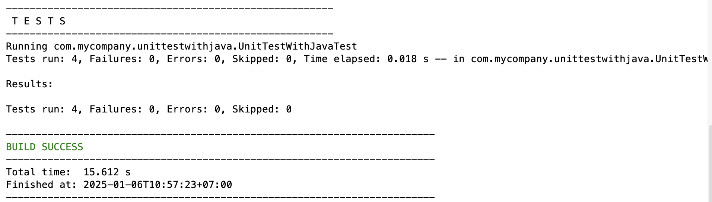

# Unit Testing with Java

## Introduction
The class is designed to perform basic arithmetic operations, including addition, subtraction, multiplication, and division of integers. The division method is specifically designed to throw an exception when dividing by zero to ensure safe usage.

## Test Cases
The test cases were conducted to verify the correctness of the methods follows:

### 1. Method `add`
- Test addition of two positive numbers: `2 + 3 = 5`
- Test addition of a negative and a positive number: `-1 + 1 = 0`

### 2. Method `subtract`
- Test subtraction of two positive numbers: `3 - 2 = 1`
- Test subtraction of a negative and a positive number: `-1 - 1 = -2`

### 3. Method `multiply`
- Test multiplication of two positive numbers: `2 * 3 = 6`
- Test multiplication with zero: `0 * 5 = 0`

### 4. Method `divide`
- Test division of two positive numbers: `6 / 3 = 2`
- Test division by zero: Throw `IllegalArgumentException` with the message "Division by zero is not allowed."

## Test Results

## ChatGPT
[ChatGPT Link](https://chatgpt.com/share/677b587a-9c14-800d-857c-2b9d77ec443e)
